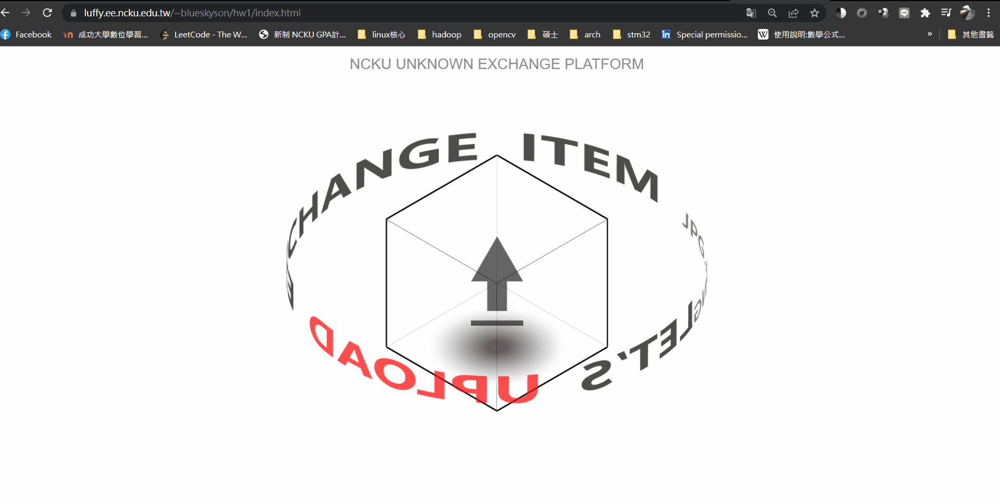

# web-programming-2022
Homework of NCKU EE web programming 2022

**HW1:** [https://luffy.ee.ncku.edu.tw/~blueskyson/hw1/index.html](https://luffy.ee.ncku.edu.tw/~blueskyson/hw1/index.html)
1. 進入網站會有旋轉的 "LET'S UPLOAD EXCHANGE ITEM JPG.PNG." 的文字，中間有會上下浮動的 "上傳ICON"。
2. 滑鼠拖動文件夾的圖片上去，"LET'S UPLOAD EXCHANGE ITEM JPG.PNG." 的文字會消失，立方體發出黑色旋轉光。
3. 上傳完成圖片自動處理成剪影並移動至畫面左方，你可以透過右方長條為他取名或按底下”錄音icon”去錄音。
4. 跟別人交換它們的物品，右側滑鼠滾輪可以上下切換其他物品，按中間"按我交換"後才開始進到下個環節。

**HW1 Demo:**

此作品單純使用 css 和 jquery 來實現網頁動畫，沒有套用任何前端框架。
